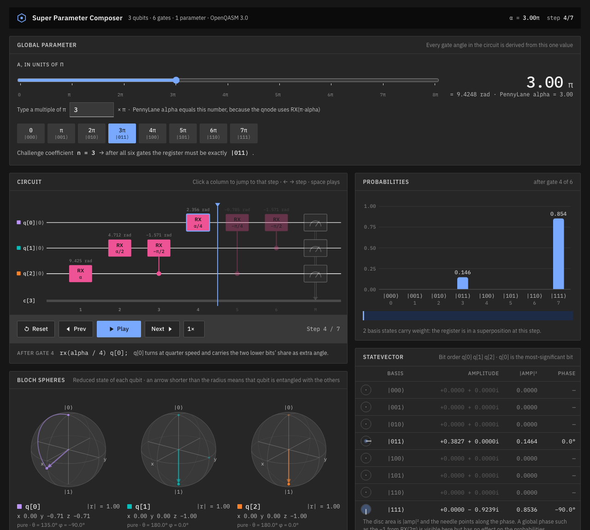

# The Super Parameter

One parameter, eight basis states. A solution to the PennyLane coding challenge
[*The Super Parameter*](https://pennylane.ai/challenges/superparameter)
(QHack 2023 Flashback, intermediate, quantum machine learning), together with a
step-by-step browser simulator that shows why the circuit has to look the way it does.

## The challenge

Build a 3-qubit ansatz with a **single** parameter `alpha` that can produce every
computational basis state `|000⟩ … |111⟩`, and return the eight values of `alpha`
(all inside `[0, 10]`) that produce them in order. The model must be continuous in
`alpha`, so the parameter has to live inside rotation angles.

## The solution

```
0: ──RX(πα/4)────────────╭RX(-π/4)─╭RX(-π/2)─┤ ╭Probs
1: ──RX(πα/2)─╭RX(-π/2)──│─────────╰●────────┤ ├Probs
2: ──RX(πα)───╰●─────────╰●──────────────────┤ ╰Probs
```

```python
@qml.qnode(dev)
def model(alpha):
    qml.RX(np.pi * alpha, wires=2)          # least-significant bit
    qml.RX(np.pi * alpha / 2, wires=1)
    qml.CRX(-np.pi / 2, wires=[2, 1])
    qml.RX(np.pi * alpha / 4, wires=0)      # most-significant bit
    qml.CRX(-np.pi / 4, wires=[2, 0])
    qml.CRX(-np.pi / 2, wires=[1, 0])
    return qml.probs(wires=[0, 1, 2])

def generate_coefficients():
    return [0, 1, 2, 3, 4, 5, 6, 7]
```

### Why it works

`RX(θ)` applied to `|0⟩` lands on a basis state only when `θ` is a whole multiple of
`π`, and on `|1⟩` when that multiple is odd. Write the coefficient as
`n = 4·b₀ + 2·b₁ + b₂` and give every wire a net angle of `π × (its own bit)`:

| wire | free rotation | controlled corrections | net angle at `alpha = n` |
|---|---|---|---|
| 2 (LSB) | `RX(πα)` | none | `π(b₂ + 2b₁ + 4b₀)` → parity `b₂` |
| 1 | `RX(πα/2)` | `CRX(−π/2)` from wire 2 | `π(n − b₂)/2 = π(b₁ + 2b₀)` → parity `b₁` |
| 0 (MSB) | `RX(πα/4)` | `CRX(−π/4)` from wire 2, `CRX(−π/2)` from wire 1 | `π(n − b₂ − 2b₁)/4 = π·b₀` |

Think of an odometer. The fastest wheel flips every step, the next every two steps,
the next every four. A free rotation at half speed does not *click* like an odometer
wheel; it drifts, so when the fast bit is 1 the slow wire is sitting half a notch off
and is in a superposition. The controlled gates subtract exactly that leftover.
Because each lower wire is already in a definite basis state when it acts as a
control, the corrections are applied deterministically and every wire ends clean.

A single layer of uncontrolled rotations cannot do this. With `RX(cₖ α)` on each wire,
the state `|001⟩` forces the ratio `c₀/c₂` to be even/odd while `|100⟩` forces it to be
odd/even, which no single rational number satisfies. Some entangling correction is
unavoidable.

## Files

| path | what it is |
|---|---|
| `super_parameter.ipynb` | Challenge statement, derivation, solution, circuit drawing and the official test harness, executed with outputs |
| `solution.py` | The complete challenge file, ready to paste into the PennyLane editor |
| `simulator/index.html` | Standalone interactive simulator, open it in any browser |
| `simulator/circuit_simulator.html` | Head-less source of the same page, used for artifact publishing |
| `simulator/build.py` | Regenerates `index.html` from the source fragment |

## Run it

```bash
pip install -r requirements.txt
python solution.py            # prints "Correct!" after about a minute
```

The minute is the challenge's own continuity check: it evaluates the circuit at
10,000 points in `[0, 10)`, three times each. The notebook runs the same cells.

## Interactive simulator



`simulator/index.html` is a single file with no dependencies beyond Google Fonts.
All 3-qubit math is written in plain JavaScript: `RX` as a 2×2 complex matrix,
single-qubit gates as Kronecker products with identities, and `CRX` as
`P₀ ⊗ I + P₁ ⊗ RX` on the control and target factors.

- **Circuit canvas** with a playhead. Click any column to jump to that step, or use
  the transport controls, arrow keys and space.
- **Global alpha controller**: a slider in units of π, a numeric box and preset
  chips for the eight challenge coefficients. Every panel recomputes instantly.
- **Probability chart** and **statevector table** with amplitude, probability, phase
  angle and a phase disc for each basis state.
- **Measurement step** samples an outcome from the current distribution and shows
  the collapse, with the pre-measurement bars kept as outlines.
- **Bloch spheres**, one per qubit in its own colour, drawn from each qubit's
  reduced density matrix. Stepping animates the arrow along the arc the gate traces.
  An arrow shorter than the radius means that qubit is entangled with the others,
  which happens only when `alpha` is not a whole multiple of π.
- **Per-qubit readout** showing `P(q[k] = 1)` with a clean/superposed indicator.
- **OpenQASM 3.0 listing** with the just-executed line highlighted.

Bit order is `q[0] q[1] q[2]` with `q[0]` the most-significant bit, matching
`qml.probs`. In the QASM listing `alpha` is the angle itself, so the basis states sit
at `alpha = nπ`; the PennyLane `alpha` is the multiple `n`.

## Verification

- All eight coefficients give probability 1.000000 on the intended basis state.
- The continuity sweep produces zero violations.
- Tested with PennyLane 0.38 on Python 3.9.

## License

MIT
